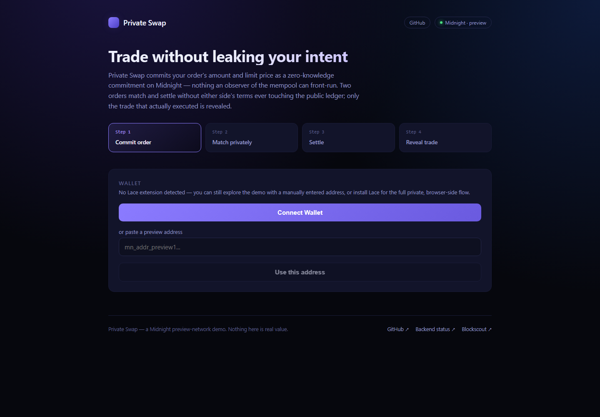
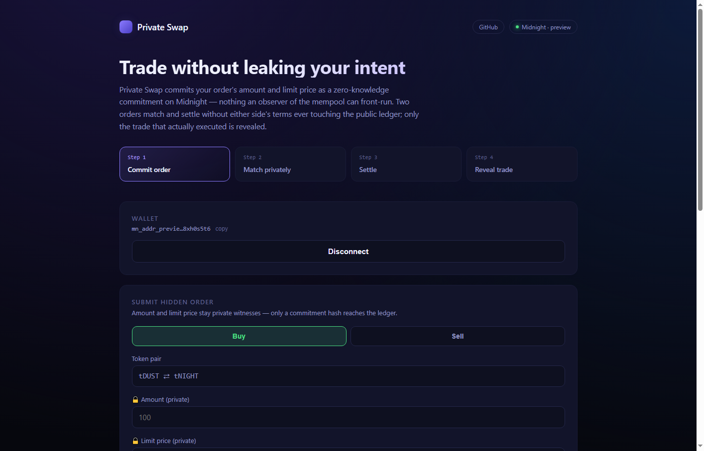
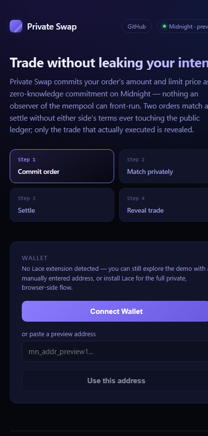

# Private Swap — Midnight (preview network)

[](https://github.com/rohan911438/Midnight/actions/workflows/ci.yml)

A front-running-resistant token swap built on Midnight's selective-disclosure
model. Swap orders (amount + limit price) stay hidden on-chain as a
zero-knowledge commitment until they're matched; only the trade that
actually executed is ever revealed.

## Why

Public order books leak intent the instant an order is submitted -- anyone
watching the mempool can front-run it. Here, `amount` and `limitPrice` are
private witness inputs to the `submitOrder` circuit; only a commitment hash
reaches the ledger. `matchOrders` proves two committed orders are
price-compatible without disclosing either side's terms. `settle` discloses
only the trade that actually executed.

## Layout

```
contracts/   hidden-order.compact -- submitOrder / matchOrders / settle circuits
backend/     Node/Express API + SQLite, orchestrates proof generation and tx submission
frontend/    Next.js swap UI: commit -> match -> settle -> before/after reveal
scripts/     compile-contract.mjs, deploy.mjs, reset-demo.mjs, check-proof-server.mjs
wallet/      generate-wallet.mjs, check-balance.mjs
docs/        demo-script.md, architecture.md, troubleshooting.md
```

## Running locally

```bash
# 1. Proof server (Docker)
docker start midnight-proof-server-1   # or: docker run -d -p 6300:6300 --name midnight-proof-server-1 midnightntwrk/proof-server:8.0.3
npm run check-proof-server

# 2. Compile the contract (Compact has no native Windows build -- via WSL2)
npm run compile-contract

# 3. Deploy to preview
npm run deploy

# 4. Backend
npm run backend

# 5. Frontend
npm run frontend
```

Config lives in `.env` (gitignored -- copy `.env.example` and fill in your own
Blockfrost preview project id). Network: **preview**. Scope, deliberately:
one matched order pair, test tokens only, no mainnet.

## Screenshots

| Landing | Wallet connected + submit form |
|---|---|
|  |  |

<details>
<summary>Mobile viewport (430px)</summary>



</details>

Captured from the live Vercel deployment. The wallet shown is the manual
preview-address fallback (no Lace extension in the headless capture
environment) -- with Lace installed, the same "Wallet" card shows a **LACE**
badge and connects through `@midnight-ntwrk/dapp-connector-api` instead
(see [Status](#status)).

## CI/CD

[`.github/workflows/ci.yml`](.github/workflows/ci.yml) runs on every push
and PR to `main`, three jobs in parallel:

| Job | What it does |
|---|---|
| `contract` | Installs the Compact toolchain, `compact update 0.31.1`, compiles `hidden-order.compact` |
| `backend` | `npm ci` + `npm test` (10 tests: validation + SQLite schema) |
| `frontend` | `npm ci` + `npm run build` (full Next.js production build, including the browser-side circuit-execution bundle) |

All three were broken as of 2026-08-22 -- confirmed via the Actions API and
reproduced locally rather than guessed:

- `contract` failed on every run because `compact compile +VERSION` selects
  an already-installed toolchain version rather than fetching it; a fresh
  runner has nothing installed. Fixed by adding a `compact update 0.31.1`
  step first.
- `frontend` failed because CI installs each npm workspace member in
  isolation (`npm ci` scoped to `frontend/`), so it never gets
  backend-only dependencies hoisted in -- `scripts/sync-frontend-zk-assets.mjs`
  (frontend's own `prebuild` step) imported `dotenv`, which is only
  declared in `backend/package.json`, and crashed before `next build` even
  started. Fixed by dropping that dependency for a dozen-line hand-rolled
  parser (the script only ever reads two keys).
- `backend` was already passing (npm workspaces resolve the root lockfile
  even when `npm ci` is invoked from a member subdirectory).

Both fixes were verified by reproducing the exact failing steps in a fresh
clone before pushing, not just by re-running CI and hoping. Current status:
green -- see the badge above, or the [Actions tab](https://github.com/rohan911438/Midnight/actions).

Deployment itself (Vercel for the frontend, Render for the backend) is
manual via each platform's CLI/API right now, not wired into CI as an
auto-deploy-on-green step -- see [Deployment](#deployment) for the live
URLs and how each was set up.

## Deployment

**Network:** Midnight preview
**Contract address:** not yet deployed -- see [Status](#status) and
[`docs/troubleshooting.md`](docs/troubleshooting.md) for why, and exactly
what's blocking it. Short version: the deploy signer's Night UTXO is
confirmed registered for Dust generation (has been for 6+ days as of this
writing), but the Dust sub-wallet's sync against the preview indexer never
converges, so the wallet never reports a spendable Dust balance and
`npm run deploy` fails with `Wallet.InsufficientFunds`. This is one command
away from working the moment that clears -- everything downstream of it
(the contract, providers, wallet, frontend) is built and independently
verified.

Compiled contract artifacts (`contracts/build/{compiler,contract,keys,zkir}`)
are committed to this repo so the circuit compilation output can be
verified without re-running the WSL2 toolchain -- see
[`contracts/README.md`](contracts/README.md).

**Live demo:**

- Frontend: **https://private-swap-frontend.vercel.app**
- Backend API: **https://private-swap-backend.onrender.com** (`/api/health`),
  also reachable through the frontend's own `/api/*` proxy
- Wallet connect (Lace, via `@midnight-ntwrk/dapp-connector-api`) and the
  browser-side `submitOrder` circuit path (`frontend/lib/contract.ts`) are
  both live; submitting will fail until `NEXT_PUBLIC_CONTRACT_ADDRESS` is
  set post-deploy (see above)
- Backend is on Render's free tier -- the first request after a period of
  inactivity may take ~30-60s to respond while the instance spins back up

## Status

| Piece | Status |
|---|---|
| `hidden-order.compact` | Compiles cleanly, real prover/verifier keys generated for all 3 circuits (verified via WSL2, toolchain 0.31.1); build output committed under `contracts/build/` |
| Preview wallet | Generated and funded (5000 tNight), registered for Dust generation since 2026-08-17 |
| Local proof server | Running, healthy (`localhost:6300`) |
| Backend (Express + SQLite) | Boots, routes work, verified with curl |
| Frontend (Next.js) | Builds and typechecks cleanly (`npm run build --prefix frontend`) |
| Lace wallet connect/disconnect | Real `@midnight-ntwrk/dapp-connector-api` integration (`frontend/lib/wallet.ts`, `components/WalletConnect.tsx`), falls back to manual address entry when the extension isn't installed |
| Browser-side circuit execution | `submitOrder` proof generation, signing, and submission run client-side against the connected Lace wallet (`frontend/lib/contract.ts`) -- not proxied through the backend. `matchOrders`/`settle` stay backend-orchestrated (see [`docs/architecture.md`](docs/architecture.md) for why) |
| Frontend UI | Hero + step tracker, wallet card with copy/disconnect, order book empty/loading states, footer with live links -- see [Screenshots](#screenshots) |
| Wallet balance check (`wallet/check-balance.mjs`) | **Works** -- confirms the funded 5000 tNight |
| `npm run register-dust` | **Confirmed succeeded on-chain** (Night UTXO shows `registeredForDustGeneration: true`) |
| `scripts/deploy.mjs` (full facade) | **Blocked** on a Dust-sync issue, not a config error -- see [`docs/troubleshooting.md`](docs/troubleshooting.md) |
| Frontend live deploy (Vercel) | Live -- see [Deployment](#deployment) and [Screenshots](#screenshots) |
| Backend live deploy (Render) | Live, health-checked -- see [Deployment](#deployment) (Railway's trial had expired; Render was used instead) |
| CI (`.github/workflows/ci.yml`) | Green -- was broken on every run before this pass, see [CI/CD](#cicd) |

Three real, distinct SDK/config bugs were found and fixed along the way (a
broken Blockfrost RPC endpoint, a completely unauthenticated indexer
subscription, and a wallet-sync completeness check that could never be
satisfied for a low-activity wallet) -- all diagnosed with raw connectivity
tests and targeted SDK-level diagnostics rather than guessed, and all
confirmed fixed (the wallet reliably reaches a synced state in seconds now,
down from never). What's left is a fourth, narrower issue: the Dust
sub-wallet's sync never converges, so no spendable Dust balance ever
materializes despite a confirmed on-chain Dust registration. Full
investigation, what's ruled out, and next steps are in
[`docs/troubleshooting.md`](docs/troubleshooting.md).

### Dependencies added for browser-side wallet/circuit execution

`frontend/package.json` now depends directly on:

- [`@midnight-ntwrk/dapp-connector-api`](https://www.npmjs.com/package/@midnight-ntwrk/dapp-connector-api) -- typed connect/disconnect and provider-config surface for the injected Lace wallet
- `@midnight-ntwrk/midnight-js-contracts`, `-types`, `-network-id`, `-indexer-public-data-provider`, `-http-client-proof-provider`, `-fetch-zk-config-provider`, `@midnight-ntwrk/compact-js`, `@midnight-ntwrk/ledger-v8` -- the same circuit-execution stack the backend uses, reconfigured for the browser (proof/indexer URIs come from the connected wallet's own `getConfiguration()` instead of `.env`; ZK artifacts are fetched from `frontend/public/{keys,zkir}` instead of the filesystem)

Note: `@midnight-ntwrk/midnight-js-network-provider` (as sometimes referenced)
isn't a real published package -- confirmed via `npm view`, 404. The actual
network-id/config wiring lives in `@midnight-ntwrk/midnight-js-network-id`
(already a backend dependency, now also a frontend one) plus the wallet's
own `getConfiguration()`.